<!-- Typing header -->

  

<!-- Connect + profile views -->

  
  
  

# 👋 Hi, I'm Sina, an Embedded AI Engineer based in Bologna 🇮🇹

I work where **machine learning meets real hardware**. I train models on a laptop, then quantize
them and run them on microcontrollers, where every kilobyte and millisecond matters. Before moving
into embedded AI I spent three years as a control and instrumentation engineer, so I enjoy problems
that span the whole stack, from a sensor on a pump to a dashboard in the browser.

## About me

- 🎓 M.Sc. **Electronic Engineering** at the University of Bologna, focused on Edge AI, IoT, and embedded systems
- 🎓 B.Sc. **Control Engineering** at the University of Tehran
- 🤖 I build **AI that runs on microcontrollers**: TinyML, int8 quantization, and multimodal sensor fusion
- 🏭 Previously spent **3 years** as a control and instrumentation engineer across 12 water pumping and treatment plants
- 🔬 Recent work: anomaly detection on an ESP32, pump cavitation detection from sound and vibration, and a full IoT desk monitor
- 🌱 Currently digging into **RISC-V**, **PULP**, and squeezing bigger models onto smaller hardware
- 🎯 Looking for a **curricular internship** in Embedded Systems / Edge AI / IoT / Firmware
- 📫 Reach me at **mohebbixsina@gmail.com**

## 🎓 Education

- **M.Sc. Electronics for Big Data, IoT &amp; Intelligent Systems** &nbsp;
- **B.Sc. Control Engineering** &nbsp;

## 🔧 Featured Projects

<table>
<tr>
<td width="50%" valign="top">

### ⚙️ [edgeAI-MachineSense](https://github.com/sina-mohebbi/edgeAI-MachineSense)

Detects when a machine starts to sound unhealthy, using a small **autoencoder** that is quantized to int8 and runs directly on an ESP32. It learns what a healthy machine sounds like and flags anything different, reaching 0.86 AUC at 49 ms per inference on the board.

</td>
<td width="50%" valign="top">

### 🔊 [edge-ai-sensor-fusion](https://github.com/sina-mohebbi/edge-ai-sensor-fusion)

Detects **cavitation in a centrifugal pump** using sensor fusion, combining a microphone and a vibration sensor in one small neural network. It is evaluated only on recordings it has never seen, so the accuracy reflects real generalization to a new pump.

</td>
</tr>
<tr>
<td width="50%" valign="top">

### 🖥️ [library-desk-sense](https://github.com/sina-mohebbi/library-desk-sense)

A complete **IoT system for monitoring library desks**. An ESP32 senses occupancy, light, and noise and streams the data over HTTP/CoAP to a Python backend that stores it in InfluxDB, shows live Grafana dashboards, and pushes Telegram alerts.

</td>
<td width="50%" valign="top">

### 🧩 [jigsaw-puzzle-reconstruction-dl](https://github.com/sina-mohebbi/jigsaw-puzzle-reconstruction-dl)

A **visual-reasoning** model that rebuilds a 96×96 image after it is cut into 9 shuffled, partly erased tiles. It has to infer where each piece belongs and fill in the missing borders, with no position labels to guide it.

</td>
</tr>
<tr>
<td width="50%" valign="top">

### 🦾 6-DOF Robotic Arm Communication &nbsp;·&nbsp; *B.Sc. Thesis*

Control and monitoring of a **6-DOF pick-and-place robotic arm** over Modbus and CAN. It ties together motor commands, sensor feedback, and remote operation through SCADA and a Bluetooth mobile app.

</td>
<td width="50%" valign="top">
</td>
</tr>
</table>

## 🔧 What I build: from sensor signal to on-device AI

Sensor signal → FFT → neural network → microcontroller → deployment
<!-- Profile banner -->

  

## 🛠️ Tech I work with

**Languages**

**Embedded &amp; Edge AI**

**ML / Signal**

**Protocols**

**Tools**

## 📊 GitHub in numbers

  
  

  

  

<!-- Contribution activity graph -->

  

